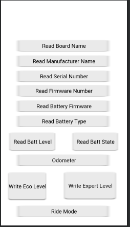

BLERW
=====

    compileSdkVersion 26
    buildToolsVersion "26.0.2"
    gradle:4.0.0

Project built in Android Studio.

Known Issues:
View breaks when changing from portrait. Thankfully this helps reset the BLE connection so its a feature
My odometer does not jive with other app readings. Odometer field currently has the hex and decimal revolution counters for debugging.

Nice to Haves
Any sort of notification for battery 
Saving of prior connected devices

To build this on your phone directly you will need to enable debugging. This has been tested to work against a mini x on a Pixel 2, Nexus 5x, and Moto X4.

Android BLE Scan and Characteristics Read/Write Example

 

# License

Apache License Version 2.0
