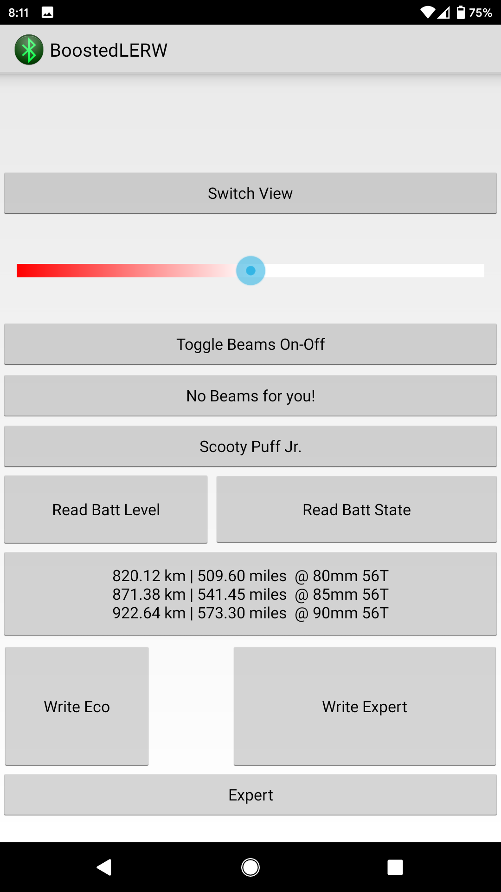
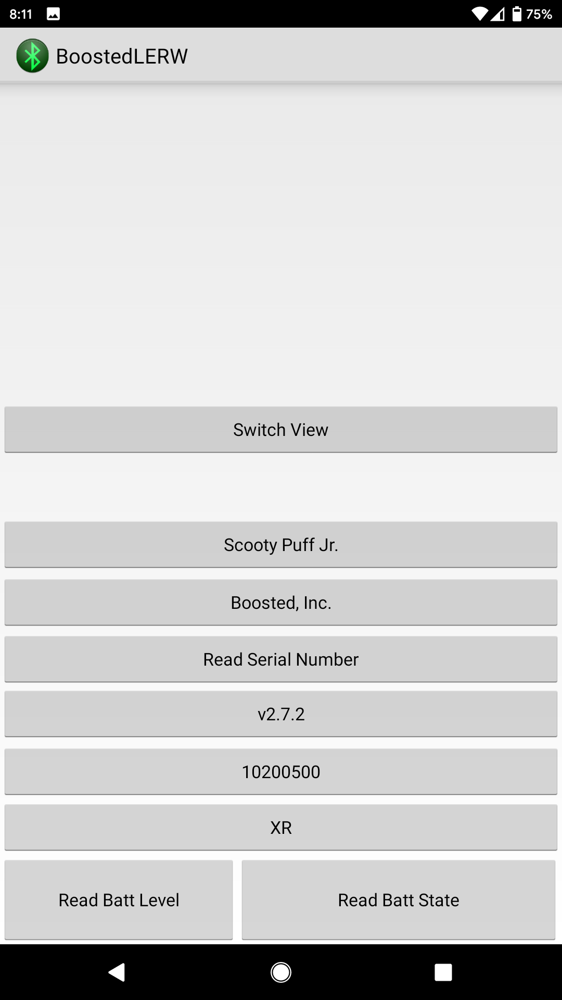

BLERW
=====

    compileSdkVersion 26
    buildToolsVersion "26.0.2"
    gradle:4.0.0

Project built in Android Studio.

APK can now be downloaded from the project main. Will try to maintain this link.
https://github.com/FDRs-Legs/BoostLERW/blob/master/app-debug_0-0-1.zip

Known Issues:

View breaks when changing from portrait. Thankfully this helps reset the BLE connection if it seems to hang while reading initial data.
Surely this is a feature

My odometer does not jive with other app readings. Only calculated in kilometers like a civilized person.
Odometer is calculated from 3 signed bytes converted to a hexstring before converting to decimal multiplied by 2piR (2xR=80,85,90 millimeter hardcoded) then divided by a ratio that is stumping me. It should be 56/17 (3.3) however it seems to be closer to 4.32

Nice to Haves:

Any sort of notification for battery 

Saving of prior connected devices

To build this on your phone directly you will need to enable debugging. 

To build the APK and install you will need to self-sign and configure your phone for sideloading.

This has been tested to work against a Boosted Mini x on a Pixel 2, Nexus 5x, and Moto X4.

Android BLE Scan and Characteristics Read/Write Example

 

# License

Apache License Version 2.0
