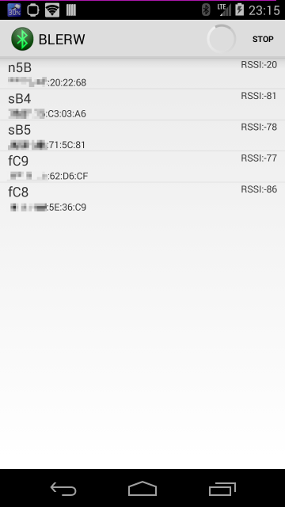

BLERW
=====

    compileSdkVersion 26
    buildToolsVersion "26.0.2"
    gradle:4.0.0

Project built in Android Studio.

You can side load th 6/18/2020 apk from the zip file app-debug.zip
https://filebin.net/d42wobkhynne77i4/app-debug.zip?t=iqdv1w07

Known Issues:

View breaks when changing from portrait. Thankfully this helps reset the BLE connection if it seems to hang while reading initial data.
Surely this is a feature

My odometer does not jive with other app readings. Odometer field currently has the hex and decimal revolution counters for debugging.

Nice to Haves:

Any sort of notification for battery 

Saving of prior connected devices

To build this on your phone directly you will need to enable debugging. 

To build the APK and install you will need to self-sign and configure your phone for sideloading.

This has been tested to work against a Boosted Mini x on a Pixel 2, Nexus 5x, and Moto X4.

Android BLE Scan and Characteristics Read/Write Example

 

# License

Apache License Version 2.0
